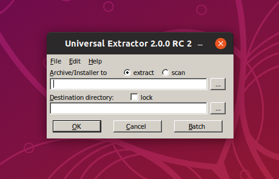
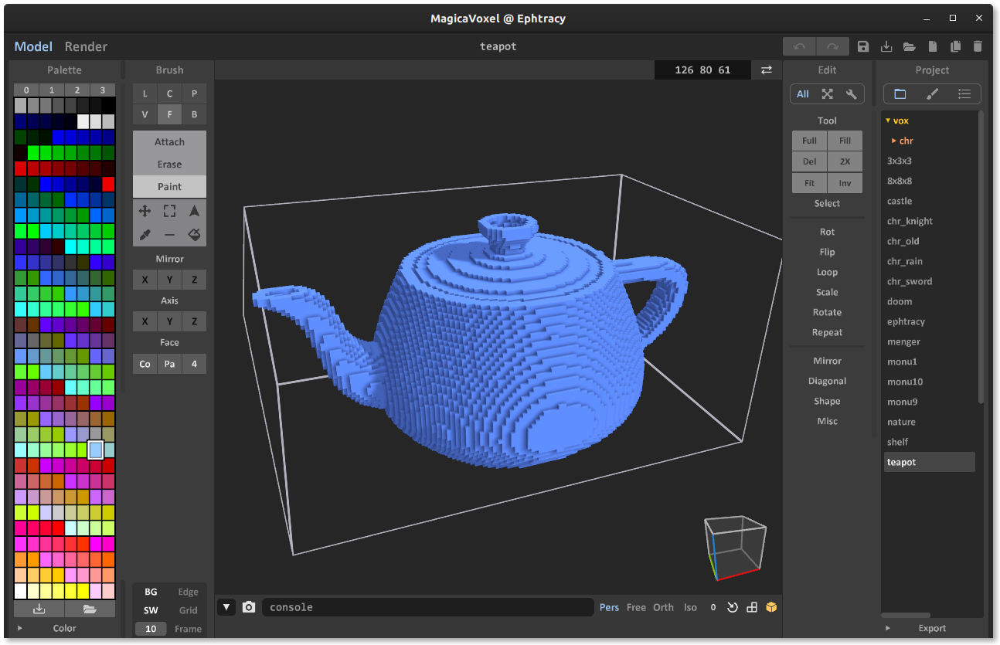

# PlayOnLinux scripts

> A collection of various scripts to install Windows applications on Linux using PlayOnLinux.

This repository contains various installer scripts I wrote for [PlayOnLinux](https://www.playonlinux.com/en/).

The easiest way to run them is using the `playonlinux-bash` command:

```
playonlinux-bash script.sh
```

## Included scripts

### Universal Extractor 2



[UniExtract2](https://github.com/Bioruebe/UniExtract2) is an unofficial fork of the unmaintained [original UniExtract](http://legroom.net/software/uniextract). It allows extracting many (installer) archives without needing to actually install the software.

The script is also available at the [PlayOnLinux website](https://www.playonlinux.com/en/app-3483.html).

### MagicaVoxel



[MagicaVoxel](https://ephtracy.github.io/) is a free lightweight 8-bit voxel art editor and interactive path tracing renderer by [ephtracy](https://twitter.com/ephtracy).

The script is also available at the [PlayOnLinux website](https://www.playonlinux.com/en/app-3499.html).
